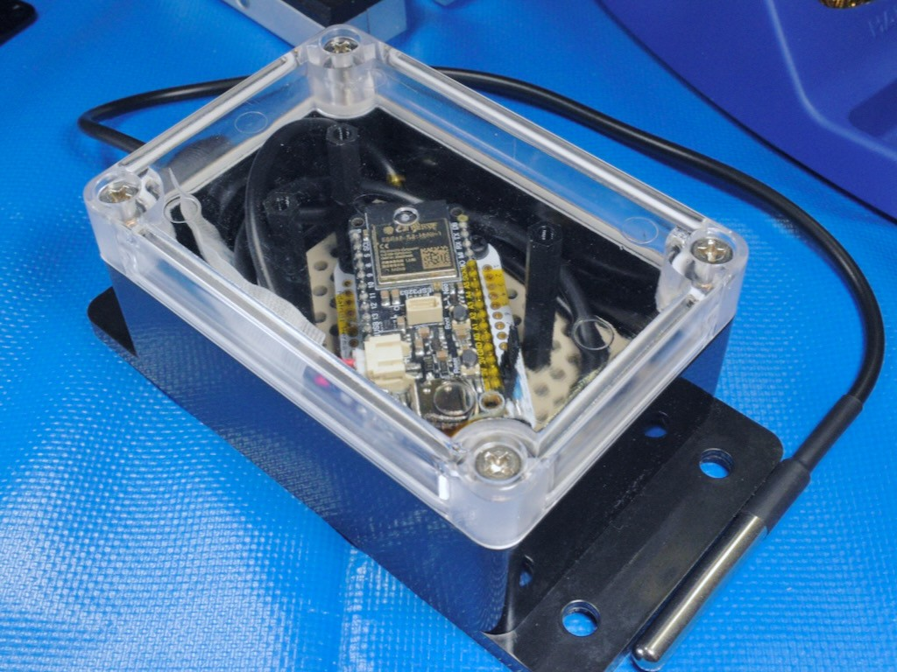
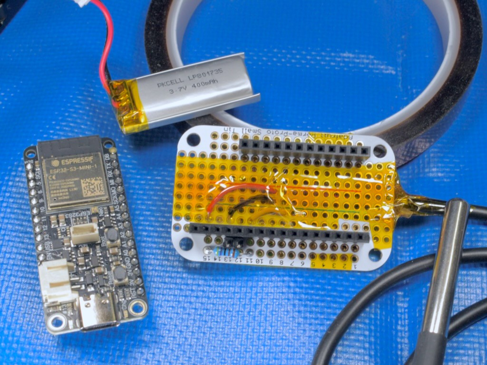
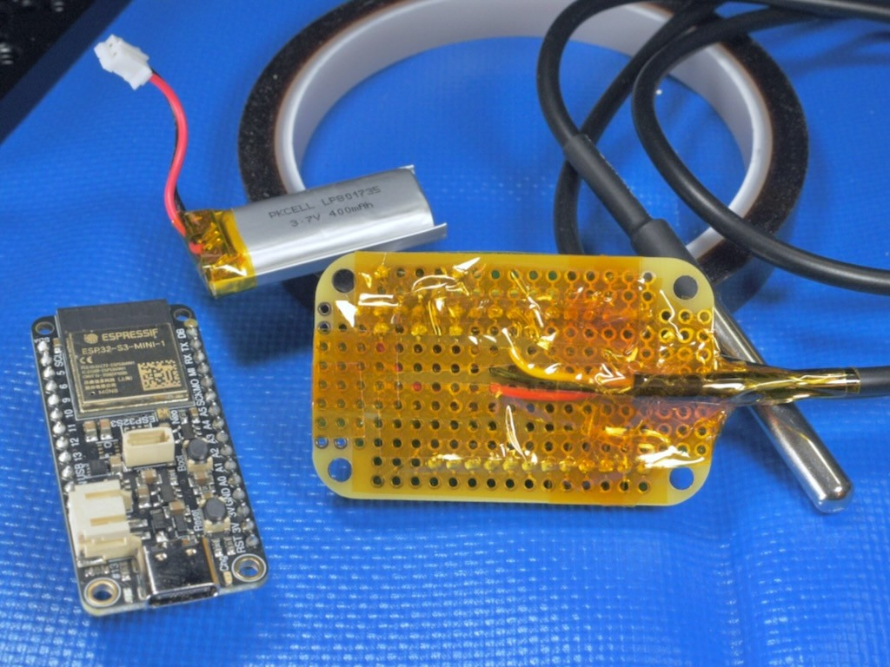
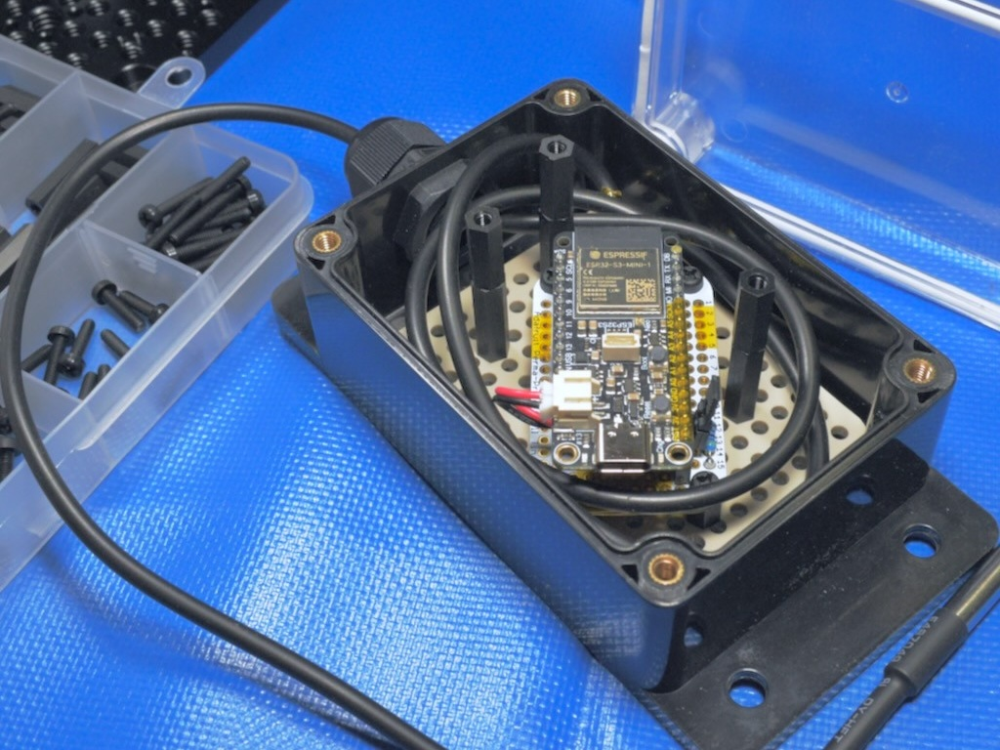

<!-- SPDX-License-Identifier: CC-BY-SA-4.0 -->
<!-- SPDX-FileCopyrightText: Copyright 2024 Sam Blenny -->
# Greenhouse Logger

These loggers track temperatures in greenhouses. The main design goal is to
cheaply record how different greenhouse structures respond to a range of
weather conditions, particularly in off hours when no gardeners are present.

The loggers don't need to be fancy. Capacity to record measurements at 20
minute intervals for up to a week is adequate.

To save cost, this design:

1. Uses manual data collection where you periodically carry loggers between
   deployment locations and a computer workstation someplace warm and dry

2. Stores measurements in ESP32 sleep memory (RAM), which can be lost if the
   battery goes flat

3. Tracks time with the ESP32 internal real time clock (RTC) which is not very
   accurate and loses its time entirely if the main battery goes flat

Communication with the loggers uses USB serial and the CircuitPython REPL. To
make USB usable without draining the batteries too fast, the logger boards have
a jumper to wake up the USB stack. Normally, the boards spend most their time
in deep sleep mode, which interferes with USB. The logger firmware is written
to exit deep sleep mode and wake up the USB stack when it detects that pin A0
has been jumpered to ground.

## Usage

Before deploying a logger you need to:

1. Ensure the batteries are charged
2. Set the board's real time clock (RTC) which also clears the log memory
3. Remove the USB-mode jumper
4. Check the desiccant pack
5. Seal up the enclosure

At the end of a logging period, you need to:

1. Connect to the logger's CircuitPython REPL over USB serial
2. Dump the log and save it to a CSV file
3. Prepare the logger for redeployment or storage

### Initial Setup Procedure:

1. Unseal enclosure, remove board, install the A0 to GND jumper
2. Connect USB cable
3. Connect to the USB serial port and enter the REPL (Ctrl-C, then Enter)
4. Import the `util` module, set RTC time with `util.set_clock()`. Note that
   setting the time also updates the epoch (so timestamps fit in 16-bits) and
   clears the log memory (because epoch changed).
5. Check battery voltage with `util.batt()`
6. For boards with built in charger, leave USB connected until battery is full.
   For boards without a charger, disconnect battery, charge it however you can,
   then reconnect it.
7. Exit the REPL (Ctrl-D), disconnect serial terminal, eject CIRCUITPY drive
8. Unplug USB cable
9. [VERY IMPORTANT] Remove A0 to GND jumper (move it to just the GND pin)
10. Put board back in enclosure, check desiccant, seal it up

### Log Download Procedure:

1. Unseal enclosure, remove board, install the A0 to GND jumper
2. Connect USB cable
3. Connect to the USB serial port and enter the REPL (Ctrl-C, then Enter)
4. Import the `util` module
5. Check RTC time with `util.now()`, noting actual time to check for drift
6. Dump CSV format log with `util.dump()`
7. Copy and paste log from serial terminal to a CSV file
8. Check battery voltage with `util.batt()`
9. For boards with built in charger, leave USB connected until battery is full.
   For boards without a charger, disconnect battery, charge it however you can,
   then reconnect it.
10. Exit the REPL (Ctrl-D), disconnect serial terminal, eject CIRCUITPY drive
11. Unplug USB cable
12. [VERY IMPORTANT] Remove A0 to GND jumper (move it to just the GND pin)
13. Put board back in enclosure, check desiccant, seal it up

### Storage Procedure:

1. Unseal the enclosure
2. Disconnect battery
3. Put board back in enclosure, check desiccant, seal it up

### List of `util` Functions for REPL

Setup and log downloading works by entering the CircuitPython REPL, importing
the `util` module, then calling functions from `util`:

- `util.now()`: check RTC time
- `util.set_clock()`: set RTC time, set epoch, and clear log
- `util.batt()`: check battery status on boards that have a MAX17048 fuel gauge
- `util.dump()`: dump timestamped temperature and battery log in CSV format

## Hardware

### Parts

This project is designed for making several loggers using parts on hand or
whatever is cheap and available. Each logger needs a dev board, temperature
sensor, setup-mode jumper, battery pack, and enclosure.

ESP32-S3 Dev Board:
- Adafruit ESP32-S3 Feather - 8MB Flash No PSRAM (#5323)
- Adafruit Metro ESP32-S3 - 16 MB Flash, 8 MB PSRAM (#5500)
- Adafruit QT Py ESP32-S3 - 8 MB Flash, No PSRAM (#5426)
- Adafruit QT Py ESP32-S3 - 4 MB Flash, 2MB PSRAM (#5700)

Temperature Sensor and Setup-Mode Jumper:
- Waterproof 1-Wire DS18B20 Digital temperature sensor
- 4.7 kΩ thru-hole resistor
- Hookup wire
- Proto PCB or FeatherWing Doubler
- Male header pins + 2 position removable jumper (or F-F DuPont wire)

Battery Pack:
- Metro/Feather Option: 400+ mAh LiPo battery pack
- Qt Py Option: JST PH 2-Pin Cable (M) and 400+ mAh LiPo battery pack

Enclosure:
- IP65 or better water resistant outdoor junction box with cable gland
- Silica gel desiccant pack (2g should be enough)

### Tools and Consumables

You will need:
- Soldering tools
- Solder
- Kapton tape
- Electrical tape
- Drill with bit sized for installing the cable gland
- Screwdriver for the enclosure screws

### Pinouts

**CAUTION:** For reliable temperature conversions with DS18B20 1-wire sensors,
be sure to wire up the 3.3V pin (red wire). Parasitic power with the DS18B20
sensors may be unreliable, particularly with the counterfeit sensors
[which are very common](https://github.com/cpetrich/counterfeit_DS18B20).

| Feather ESP32-S3 | DS18B20      | 4.7 kΩ | GND Jumper |
| ---------------- | ------------ | ------ | ---------- |
| GND              | Black/Blue   |        | pin header |
| 3V (by RST)      | Red          | Lead 1 |            |
| A0               |              |        | pin header |
| A1               | Yellow/White | Lead 2 |            |

| Metro S3 | DS18B20      | 4.7 kΩ | GND Jumper  |
| -------- | ------------ | ------ | ----------- |
| GND      | Black/Blue   |        | DuPont wire |
| 3.3      | Red          | Lead 1 |             |
| A0       |              |        | DuPont wire |
| A1       | Yellow/White | Lead 2 |             |

| Qt Py S3 | DS18B20      | 4.7 kΩ | GND Jumper | JST PH cable |
| -------- | ------------ | ------ | ---------- | ------------ |
| GND      | Black/Blue   |        | pin header |              |
| 3V       | Red          | Lead 1 |            |              |
| A0       |              |        | pin header |              |
| A1       | Yellow/White | Lead 2 |            |              |
| GND (-)  |              |        |            | Black        |
| BAT (+)  |              |        |            | Red          |

### Soldering and Assembly

1. Solder male pin headers to Feather board. Solder female pin headers, 4.7kΩ
   resistor and 2-position jumper header to perma proto board. Prepare 1-wire
   temperature sensor cable for soldering:

   

2. Test fit battery to be sure it will fit with the temperature sensor wires:

   

3. Solder temperature sensor wires and secure cable with Kapton tape. The main
   goal here is to protect against the possibility of puncturing the battery or
   shorting pins while handling the board to download log data:

   

   

4. Install the Feather board and cover the pins next to the USB-mode jumper
   with Kapton tape (protect against static and shorts during data download):

   

6. Prepare the enclosure (drill hole for cable gland, install gasket, etc).
   Mount the Perma proto bard onto a base plate (Tamiya Universal Plate, etc)
   with M3 Nylon screws and standoffs so it won't rattle around inside the
   enclosure:

   

   

## Related Documentation:

Dev Boards:
- https://learn.adafruit.com/adafruit-esp32-s3-feather
- https://learn.adafruit.com/adafruit-metro-esp32-s3
- https://learn.adafruit.com/adafruit-qt-py-esp32-s3

1-wire Temperature Sensing:
- https://learn.adafruit.com/using-ds18b20-temperature-sensor-with-circuitpython
- https://docs.circuitpython.org/projects/onewire/en/stable/
- https://docs.circuitpython.org/projects/ds18x20/en/stable/api.html

ESP32-S3 Battery Power and Deep Sleep:
- https://learn.adafruit.com/deep-sleep-with-circuitpython/overview
- https://docs.circuitpython.org/en/stable/shared-bindings/alarm/

Miscellaneous Python Tricks:
- https://docs.circuitpython.org/en/stable/shared-bindings/struct/
- https://docs.python.org/3/library/struct.html (pack, unpack)
- https://docs.python.org/3/library/functions.html#property (decorators)

Python Time Stuff:
- https://docs.circuitpython.org/en/stable/shared-bindings/time/#time.struct_time
- https://docs.circuitpython.org/en/stable/shared-bindings/time/#time.mktime
- https://docs.python.org/3/library/time.html#time.mktime
- https://docs.python.org/3/library/datetime.html#datetime.datetime.fromtimestamp
- https://docs.circuitpython.org/projects/datetime/en/stable/api.html#adafruit_datetime.datetime.fromtimestamp

MAX17048 Battery Fuel Gauge:
- https://learn.adafruit.com/adafruit-max17048-lipoly-liion-fuel-gauge-and-battery-monitor/python-circuitpython
- https://docs.circuitpython.org/projects/max1704x/en/stable/api.html
- https://www.analog.com/media/en/technical-documentation/data-sheets/MAX17048-MAX17049.pdf

## Updating CircuitPython

**NOTE: To update CircuitPython on the ESP32-S3 boards, you need to use the
.BIN file (combination bootloader and CircuitPython core)**

1. Download the CircuitPython 9.2.1 **.BIN** file from the relevant page on
   circuitpython.org:
   - [Adafruit Feather ESP32-S3 No PSRAM](https://circuitpython.org/board/adafruit_feather_esp32s3_nopsram/)
   - [Adafruit Metro ESP32-S3](https://circuitpython.org/board/adafruit_metro_esp32s3/)
   - [Adafruit QT Py ESP32-S3 4MB Flash/2MB PSRAM](https://circuitpython.org/board/adafruit_qtpy_esp32s3_4mbflash_2mbpsram/)
   - [Adafruit QT Py ESP32-S3 No PSRAM](https://circuitpython.org/board/adafruit_qtpy_esp32s3_nopsram/)

2. Follow the instructions in the
   [Web Serial ESPTool](https://learn.adafruit.com/circuitpython-with-esp32-quick-start/web-serial-esptool)
   section of the "CircuitPython on ESP32 Quick Start" learn guide to update
   your board: first erase the flash, then program the .BIN file.

## Installing CircuitPython Code

To copy the project bundle files to your CIRCUITPY drive:

1. Download the project bundle .zip file using the button on the Playground
   guide or the attachment download link on the GitHub repo Releases page.

2. Expand the zip file by opening it, or use `unzip` in a Terminal. The zip
   archive should expand to a folder. When you open the folder, it should
   contain a `README.txt` file and a `CircuitPython 9.x` folder.

3. Open the CircuitPython 9.x folder and copy all of its contents to your
   CIRCUITPY drive.

To learn more about copying libraries to your CIRCUITPY drive, check out the
[CircuitPython Libraries](https://learn.adafruit.com/welcome-to-circuitpython/circuitpython-libraries)
section of the
[Welcome to CircuitPython!](https://learn.adafruit.com/welcome-to-circuitpython)
learn guide.
